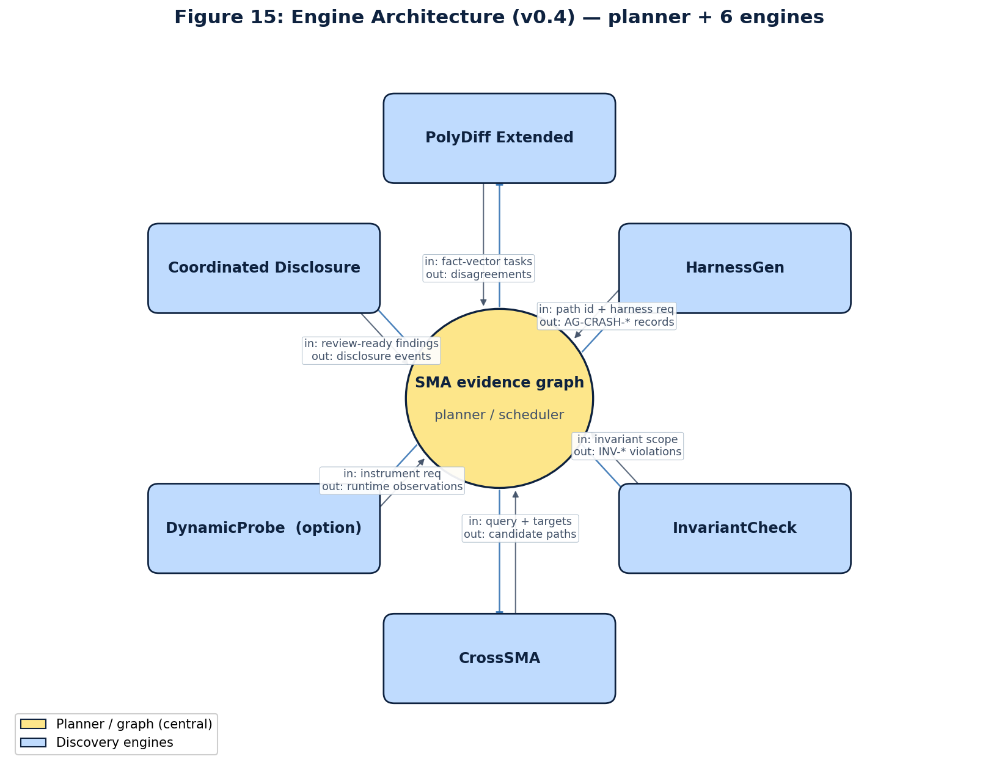
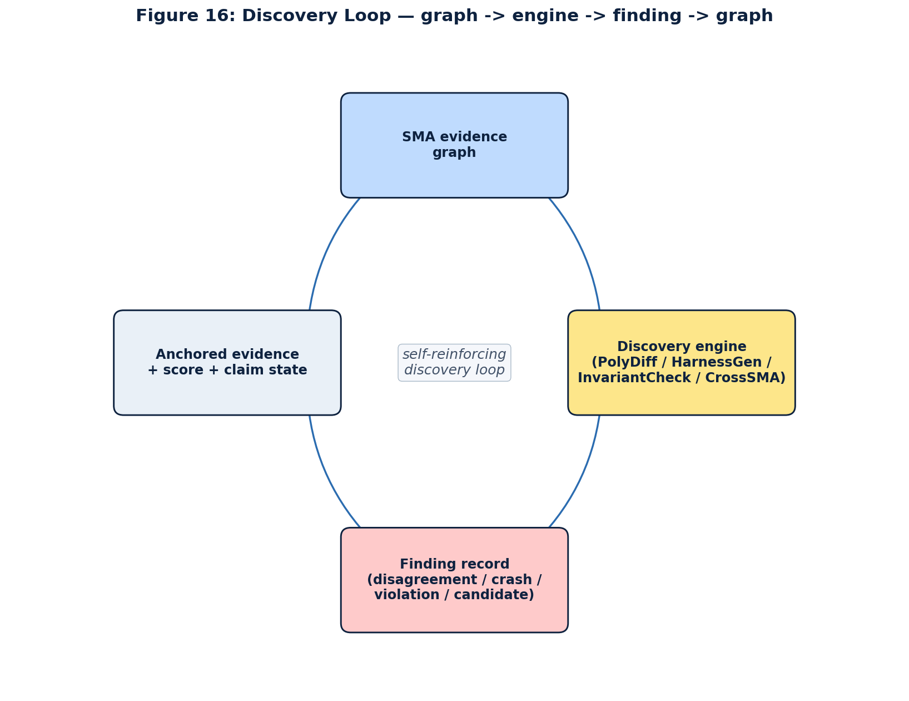
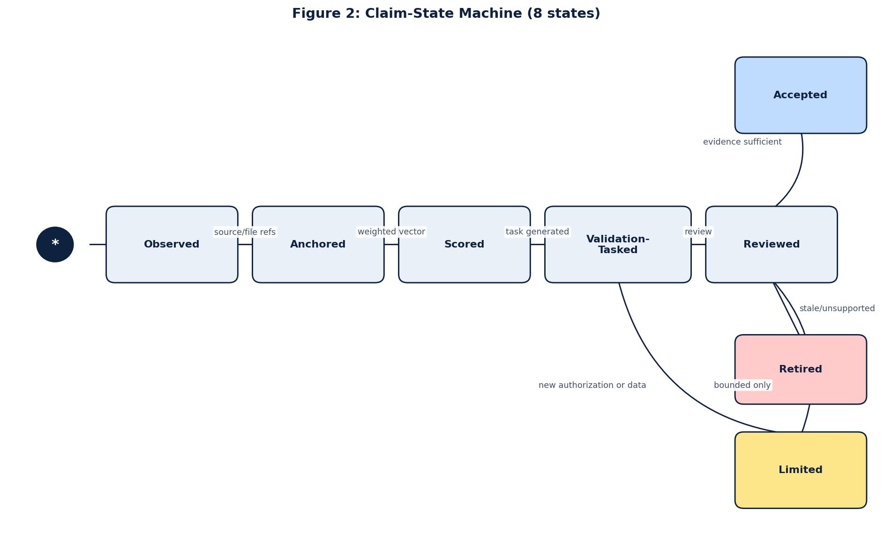
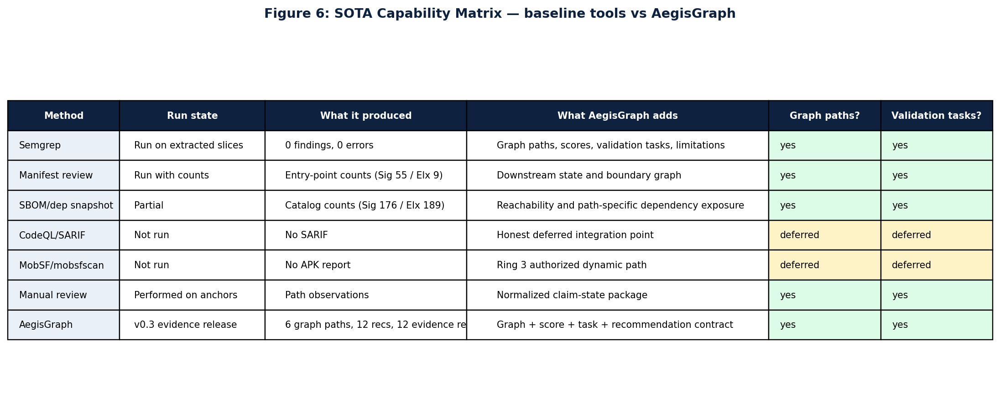

# AegisGraph for ASEMA — Public Feasibility Release

> **Graph-driven automated vulnerability discovery for secure messaging applications.** Feasibility evidence for DARPA SBIR Direct-to-Phase-II topic HR0011SB20254-12 (ASEMA).

[](LICENSE)
[](https://github.com/577Industries/aegisgraph)
[](evidence/cetm.json)
[](#the-six-engine-discovery-architecture)
[](EXCLUSIONS.md)
[](https://www.darpa.mil/research/programs/asema)



> **TL;DR for reviewers.** Six discovery engines (PolyDiff Extended, HarnessGen, InvariantCheck, CrossSMA, DynamicProbe, Coordinated Disclosure) coordinated by an evidence graph as planner. Static observations stay bounded as reachability evidence; vulnerability claims require corroboration. Every record in this release validates against published schemas; every claim has a status (Anchored / Engineering-pending / Planned). Crash-triggering bytes never leave the engineering side — only SHA-256 hashes.

---

## For Reviewers — Start Here

Three things to look at first, then a one-command reproduction.

| Goal | Look at | Why |
|---|---|---|
| Understand the system at a glance | [`figures/F15-engine-architecture.png`](figures/F15-engine-architecture.png) + [`figures/F16-discovery-loop.png`](figures/F16-discovery-loop.png) | The graph-as-planner pattern + how engine output cycles back as new evidence |
| Verify our **claim discipline** | [`figures/F2-claim-state-machine.png`](figures/F2-claim-state-machine.png) + [`docs/02_claim_discipline.md`](docs/02_claim_discipline.md) | Static observations are never promoted to vulnerability claims; the lifecycle is structurally enforced |
| Compare to **state-of-the-art tools** | [`figures/F6-sota-matrix.png`](figures/F6-sota-matrix.png) + [`docs/07_sota_comparison.md`](docs/07_sota_comparison.md) | Honest matrix; cells where AegisGraph is weaker are named explicitly |
| Verify a **specific claim** | [`evidence/cetm.json`](evidence/cetm.json) (82 claims) | Every claim has an ID, a status (A/E/P), and an evidence artifact path |
| Check what's **deliberately absent** | [`EXCLUSIONS.md`](EXCLUSIONS.md) | Crash bytes, raw source, embargoed disclosures — by design |

**One-command reproduction** (verifies this release end-to-end in under 5 minutes):

```bash
git clone https://github.com/577-Industries/asema-feasibility-artifacts
cd asema-feasibility-artifacts
git checkout v1.0.0-asema-dp2-feasibility
node evidence/validate-evidence.mjs                   # → safety_scan: passed
node evidence/validate-cetm.mjs evidence/cetm.json    # → issues_count: 0
sha256sum -c evidence/checksums.sha256                # → all OK
```

For the **full engineering reproduction** (the 1030 passing tests, the actual engine implementations), clone the engineering platform: [`github.com/577Industries/aegisgraph`](https://github.com/577Industries/aegisgraph) at tag `v1.0.0-tier3-research`.

---

## The Six-Engine Discovery Architecture



The evidence graph identifies high-value attack surface; engines hunt within it; engine output feeds back as new evidence records, new claim states, new graph edges, and (when warranted) coordinated-disclosure ledger entries.

| Engine | What it does | v1.0 state in this release |
|---|---|---|
| **PolyDiff Extended** ([F17](figures/F17-polydiff-multi-family.png)) | Multi-format differential parsing across 6 parser families (url + image + opengraph + deeplink + qr + proto), normalized fact vectors, security-relevance classifier | **6/6 families production**, 16+ anchored historical cases, **8 historical CVE rediscoveries** ([report](polydiff_regression_report.sanitized.v1.0.json)) |
| **HarnessGen** ([F18](figures/F18-harnessgen-flow.png)) | Graph-driven polyglot fuzz-harness generation (JVM/Jazzer + native/libFuzzer+HWASAN + Rust/cargo-fuzz) | **5/5 entry points scaffolded**: libwebp + libavif native; Signal LinkPreviewUtil + Element X MediaRepository JVM; matrix-rust-sdk Rust |
| **InvariantCheck** ([F19](figures/F19-invariantcheck-card.png)) | SMA-specific security-invariant library with publicly-auditable ground-truth fixtures | **15/15 production invariants** (12 CodeQL + 3 Semgrep) with MASTG/SSDF mapping |
| **CrossSMA** ([F20](figures/F20-crosssma-matrix.png)) | Cross-application propagation matrix (4 SMA targets × 6 finding patterns) | **24-cell matrix; ≥1 cell validated** (`AG-XSMA-VALIDATED-SIG-GP-001-ELX`, status `confirmed_reachable`) |
| **DynamicProbe** *(option period)* | Frida-instrumented AOSP+HWASAN emulator with signed authorization gate | Scaffold + structural authorization gate; live runs are Phase II option period |
| **Coordinated Disclosure** ([F21](figures/F21-disclosure-state-diagram.png)) | Hash-chained disclosure ledger + 7-vendor routing + day-7/14/30/60/90 embargo timer + CERT/CC fallback | **Full pipeline shipped** (39 tests pass); **0 real entries by design** pending counsel review (T-M1.4 + T-M1.5) |

The ensemble is the contribution. Composition of existing tools is engineering; the graph-as-planner coordination pattern, the multi-format differential parsing with rediscovery anchor, the polyglot harness generation under one planner, the SMA-specific invariant library with ground-truth, the automated cross-application propagation, and the structurally-enforced disclosure pipeline are the novelty.

---

## The Claim-State Discipline



Static observations stay bounded as **reachability evidence**. They are NOT promoted to vulnerability claims without engine corroboration. The lifecycle is enforced by validators in this repo:

- `evidence/validate-cetm.mjs` rejects any claim with status `I` (forbidden-implicit/unanchored)
- The `reviewed_embargoed` state is structurally blocked from public exports by sanitize-check Rule 7
- A deliberate-corruption test in the engineering validator confirms falsifiability: introducing a forbidden pattern, a target-source redistribution marker, or a score-vector key mismatch is caught and rejected

The current CETM contains **82 claims**: 53 Anchored (status A; evidence on disk), 8 Engineering-pending (status E), 21 Planned (status P; Phase II commitments). **Zero forbidden-I.**

---

## State-of-the-Art Comparison



The matrix scores AegisGraph against Semgrep, CodeQL, MobSF, FlowDroid, AFL++/libFuzzer, ProVerif/Tamarin, and skilled manual review across 10 capabilities. Cells where AegisGraph is **weaker** than a SOTA tool are named explicitly:

- KLEE / S2E / angr stronger at deep symbolic execution at scale
- FlowDroid + CodeQL stronger at general whole-program taint analysis
- ProVerif + Tamarin handle cryptographic-protocol verification (out of ASEMA scope per FAQ Q1)
- AFL++ + libFuzzer industrial CI for multi-month deep-fuzzing campaigns
- Ghidra / BinaryNinja for closed-source binary analysis

Cells where the 6-engine ensemble is uniquely capable (multi-format differential parsing across 6 families, graph-driven harness generation across polyglot toolchains, SMA-specific invariant library with publicly-auditable ground-truth, automated cross-target propagation matrix, structurally-enforced coordinated-disclosure pipeline) are anchored to specific files in this release.

The full baseline-tool comparison detail is in [`baseline-tool-delta/`](baseline-tool-delta/).

---

## What's In This Release

| Category | Files | What they prove |
|---|---|---|
| **Evidence packages** | [`evidence/aegisgraph-v0.3-evidence.json`](evidence/aegisgraph-v0.3-evidence.json), [`v0.4`](evidence/aegisgraph-v0.4-evidence.json), [`v1.0`](evidence/aegisgraph-v1.0-evidence.json) | 8 discovery runs; 6 disagreements; 7 cross-target candidates (1 validated); 12 v0.3 recommendations; 75-row traceability matrix; SOTA matrix |
| **CETM** | [`evidence/cetm.json`](evidence/cetm.json) | 82 claims, status-typed (A / E / P); 0 forbidden-I |
| **PolyDiff regression report** | [`polydiff_regression_report.sanitized.json`](polydiff_regression_report.sanitized.json), [`v1.0`](polydiff_regression_report.sanitized.v1.0.json) | 8 historical CVE rediscoveries across 6 parser families; fact-vector v2.0 schema |
| **Figure pack** | [`figures/F1-F22`](figures/) | 22 architecture, lifecycle, evidence-flow, SOTA, and engine-detail diagrams |
| **Baseline-tool delta** | [`baseline-tool-delta/`](baseline-tool-delta/) | Honest CodeQL/Semgrep/MobSF vs AegisGraph capability comparison with `MOBSF-LIMITED.md` honesty markers |
| **Validators** | [`evidence/validate-evidence.mjs`](evidence/validate-evidence.mjs), [`validate-cetm.mjs`](evidence/validate-cetm.mjs) | Schema enforcement + safety scan + CETM A/E/P discipline |
| **Checksums** | [`evidence/checksums.sha256`](evidence/checksums.sha256), [`checksums/SHA256SUMS`](checksums/SHA256SUMS) | SHA-256 integrity for every artifact |
| **Manifest** | [`manifest.json`](manifest.json) | Release version, predecessor, cut date, engineering integration commit |

---

## Reproducibility Posture

- **Cold clone reproduction**: ≤1 hour
- **Warm rebuild**: <5 minutes
- **Devcontainer pinned versions** (engineering repo): Python 3.11.9 · Clang 18 · JDK 21 · CodeQL 2.20.6 · Semgrep 1.86.0 · Go 1.22.5 · Rust 1.79.0 · Android NDK r26d
- **1030 passing tests + 19 skipped** at engineering tip `stream/integration` commit `d91c1df6` (skipped tests gated on self-hosted runner provisioning per task T-M4.1)
- **Every artifact in this release is hash-anchored** in `evidence/checksums.sha256`

Full reviewer quickstart: [`docs/00_evaluator_quickstart.md`](docs/00_evaluator_quickstart.md).

---

## What This Release Does NOT Contain (by design)

See [`EXCLUSIONS.md`](EXCLUSIONS.md) for the full list. Highlights:

- **Crash-triggering input bytes** from ReproChain or HarnessGen — only SHA-256 hashes + structure
- **Pre-disclosure findings** outside disclosure-policy authorization (ledger is currently empty pending counsel review T-M1.4 / T-M1.5)
- **Raw target source code** (Signal Android, Element X Android, matrix-rust-sdk — all public on their own GitHub repos)
- **Live target probes** or production-app traces
- **Embargoed disclosure records** (`claim_state == "reviewed_embargoed"`)
- **Engineering-private CodeQL queries + Semgrep rules**; SARIF result bodies stay engineering-side
- **Source snippets longer than 256 chars**; attacker URLs / payloads inside cross-target candidates

This is **deliberate scoping**, not omission. The sanitize-check rules that enforce these exclusions are themselves auditable in the engineering repo at [`validator/sanitize_check.py`](https://github.com/577Industries/aegisgraph/blob/v1.0.0-tier3-research/validator/sanitize_check.py).

---

## Pointers

- **Engineering platform** (Apache-2.0, full source): [`github.com/577Industries/aegisgraph`](https://github.com/577Industries/aegisgraph) at tag `v1.0.0-tier3-research` (commit `d91c1df6…`)
- **DARPA topic**: HR0011SB20254-12 — Assessing Security of Encrypted Messaging Applications (ASEMA). [Topic page](https://www.darpa.mil/research/programs/asema).
- **Detailed reviewer docs**: see [`docs/`](docs/) — evaluator quickstart, Phase-I-equivalent summary, claim discipline, release boundaries, architecture deep-dive, graph schema explainer, SMABench methodology, SOTA comparison, responsible disclosure
- **v0.3 historical anchor**: tag [`v0.3.0-asema-dp2-feasibility`](https://github.com/577-Industries/asema-feasibility-artifacts/tree/v0.3.0-asema-dp2-feasibility) — preserved for citation continuity. Every v0.3 record continues to validate against v1.0.

## License

Apache-2.0. See [`LICENSE`](LICENSE).

## Citation

If you cite this release or AegisGraph methodology in published work, use [`CITATION.cff`](CITATION.cff).
